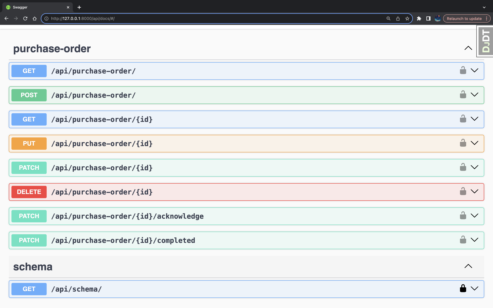
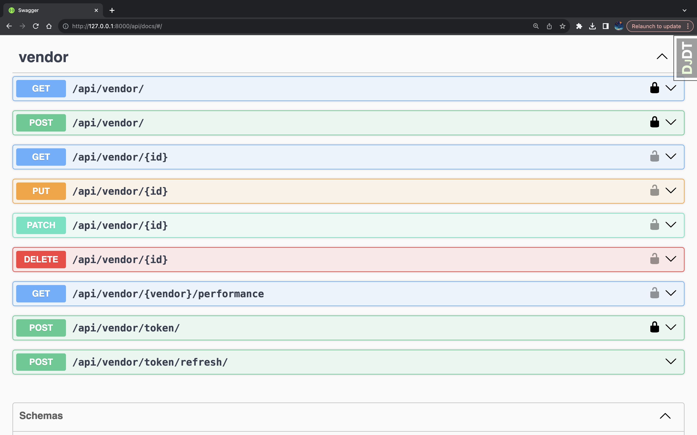

# Vendor-management-api
Vendor Management API

This repository contains the code for a Vendor Management API designed
to handle various vendor-related operations.

API Documentation.

The API endpoints and their functionalities are thoroughly documented
using Swagger. You can explore and test the API endpoints interactively
using Swagger UI.

To access the API documentation, navigate to http://localhost:8000/api/docs
after running the application. This URL will direct you to the Swagger
interface where you can find detailed information about each endpoint,
request parameters, response formats, and even test the API functionality
directly within the interface.

Getting Started

Clone this repository.

Set up the project dependencies and environment.
Run the application.

Details of Dependencies.

python version 3.11.6

Framework ~ Django==4.2.7

Following are the libraries and packages used in this api application.

django-cors-headers==4.3.1,

django-debug-toolbar==4.2.0,

django-filter==23.4,

djangorestframework==3.14.0,

djangorestframework-simplejwt==5.3.0,

drf-spectacular==0.26.5,  (swagger)

Faker==20.1.0, (we used to generate random texts in specific format.)

flake8==6.1.0, (linting tool.
see .flake8 file in django application's root directory.
use flake8 command on cli to check pep8 standard.)

python-dotenv==1.0.0

----------------------------------

Access http://localhost:8000/api/docs to explore the API documentation.
Feel free to use this API to manage vendors efficiently!

Order Related API endpoints.

Vendor Related API endpoints.

